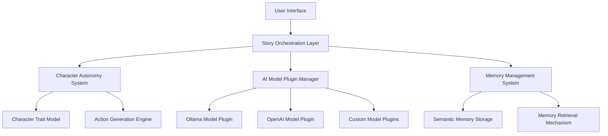

# LlamaKeeper: Architectural Vision for AI-Driven Interactive Storytelling

## Project Overview

LlamaKeeper is an innovative, locally-run interactive storytelling platform that leverages advanced AI technologies to create dynamic, autonomous narrative experiences.

## Core Architectural Principles

### 1. Modularity and Extensibility
- Plug-and-play component architecture
- Easy integration of new AI models
- Flexible system design
- Runtime configurability

### 2. Autonomous Narrative Generation
- Character-driven storytelling
- Dynamic context adaptation
- Emergent narrative progression
- Personalized story experiences

### 3. Advanced AI Integration
- Multiple AI model support
- Intelligent model selection
- Context-aware generation
- Continuous learning capabilities

## System Components

### AI Model Layer
- **Plugin-based AI model management**
- Support for multiple AI backends (Ollama, OpenAI, etc.)
- Dynamic model loading and configuration
- Advanced model validation

### Character Autonomy System
- **Intelligent character modeling**
- Persistent personality traits
- Memory-based decision making
- Autonomous action generation

### Narrative Generation Engine
- Context-aware story progression
- Multi-character interaction modeling
- Adaptive storytelling strategies
- Emergent narrative development

### Memory Management
- Semantic memory storage
- Relevance-based memory retrieval
- Long-term and short-term memory modeling
- Context-driven memory integration

## Advanced Features

### 1. Intelligent Model Selection
- Automatic model capability assessment
- Dynamic model switching
- Performance-based model ranking
- Fallback and alternative model strategies

### 2. Contextual Intelligence
- Deep context understanding
- Cross-model context injection
- Semantic reasoning
- Narrative coherence maintenance

### 3. Adaptive Learning
- Story progression analysis
- Character behavior learning
- Narrative pattern recognition
- Personalization mechanisms

## Technical Architecture

## Future Development Roadmap

### Short-Term Goals
- Implement modular AI plugin system
- Develop robust character autonomy framework
- Create advanced memory management
- Enhance narrative generation capabilities

### Mid-Term Objectives
- Multi-model AI integration
- Advanced contextual reasoning
- Personalization and learning mechanisms
- Improved narrative coherence

### Long-Term Vision
- Self-evolving narrative systems
- Cross-model intelligence
- Adaptive storytelling paradigms
- Emergent narrative experiences

## Technological Innovations

1. **Dynamic AI Composition**
   - Runtime AI model combination
   - Hybrid generation strategies
   - Intelligent model handoff

2. **Semantic Reasoning**
   - Deep contextual understanding
   - Cross-narrative inference
   - Intelligent story progression

3. **Autonomous Storytelling**
   - Character-driven narratives
   - Emergent plot development
   - Adaptive storytelling

## Ethical Considerations

- Transparent AI interactions
- User privacy protection
- Bias mitigation strategies
- Responsible AI development

## Conclusion

LlamaKeeper represents a pioneering approach to interactive, AI-driven storytelling, combining cutting-edge technologies to create immersive, dynamic narrative experiences.